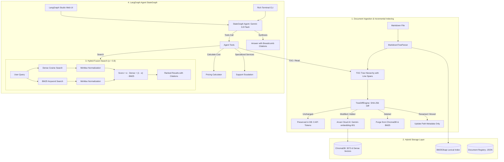

# Agentic RAG with Markdown TOC Tree, Incremental Diffing, and Hybrid Search

A production-ready **Agentic Retrieval-Augmented Generation (RAG)** application designed for technical cloud documentation, built with **LangGraph**, **LangChain**, and **Google AI Studio (Gemini 3.8 / 2.0 Flash)**.

---

## 🌟 Key Features

1. **Hierarchical Markdown TOC Parser (`MarkdownTreeParser`)**:
   - Parses Markdown documents into an Abstract Syntax Tree (AST) / Table of Contents (TOC) based on ATX headings (`#` to `######`).
   - Protects code blocks: comments inside code blocks (````` ```python # comment ``` `````) are strictly ignored.
   - Computes deterministic node IDs and hierarchical breadcrumb paths (e.g., `Document > Architecture > Storage`).
   - Prepends breadcrumb context to every embedding chunk for high semantic precision.
   - Calculates deterministic SHA-256 content hashes for every section.

2. **Incremental Tree Diff Engine (`TreeDiffEngine`)**:
   - Compares document versions to detect **Unchanged**, **Modified**, **Added**, **Deleted**, and **Renamed/Moved** sections.
   - **Zero-Token Invariant**: Preserves unchanged sections without calling embedding APIs, saving substantial tokens and API costs.
   - Renamed/Moved heading optimization updates metadata directly without re-embedding.

3. **Hybrid Search Store (`HybridSearchStore`)**:
   - Combines **Dense Semantic Embeddings** (ChromaDB + Arvan Cloud AI / Google GenAI) with **Lexical Keyword Search** (BM25 Okapi).
   - MinMax normalization balances unbounded BM25 scores with cosine similarity.
   - Tunable alpha coefficient $\alpha \in [0.0, 1.0]$ (Default: $\alpha = 0.8$):
     $$\text{Score}(d) = \alpha \cdot \text{NormalizedDenseScore}(d) + (1 - \alpha) \cdot \text{NormalizedBM25Score}(d)$$

4. **Official Cloud Server Pricing Calculator (`calculate_server_price`)**:
   - Calculates exact hourly and monthly costs in **Tomans (تومان)** based on official Arvan Cloud Server pricing tables.
   - **Mandatory Requirements**: `cpu_cores`, `ram_gb`, `storage_gb`.
   - **Optional Parameters**: `region` (`iran`/`europe`), `tier` (`basic`/`standard`/`premium`), `storage_type` (`ssd`/`hdd`), `download_traffic_gb`, `upload_traffic_gb`, `backup_gb`, `snapshot_gb`.
   - Generates formatted Persian Markdown cost breakdowns.

5. **Customer Support Escalation Protocol (`escalate_to_support`)**:
   - Enforces a clear policy: specialized services (Local Disk, File Storage/NFS, Additional IPs, GPUs, BYOIP) are escalated directly to support and sales rather than automated guessing.

6. **LangGraph Agent with Persian Knowledge Prompt**:
   - Native Persian system prompt equipped with domain expertise across Arvan Cloud Server infrastructure.
   - Cycled tool-calling StateGraph: `START` $\to$ `agent` $\to$ `tools` $\to$ `agent` $\to$ `END`.
   - Rich interactive CLI and official **LangGraph Studio** visual UI support.

---

## 🏗️ System Architecture



---

## 🚀 Quickstart & Setup

### 1. Requirements
- Python 3.12 or 3.13
- [`uv`](https://github.com/astral-sh/uv) package manager

### 2. Install Dependencies
```bash
uv sync
```

### 3. Environment Configuration
Copy `.env.example` to `.env`:
```bash
cp .env.example .env
```

Configure your credentials in `.env`:
```env
# Arvan Cloud AI Embedding Credentials (OpenAI-compatible)
ARVAN_AI_BASE_URL=https://models-interview.arvancloudai.ir/v1
ARVAN_AI_API_KEY=your_arvan_api_key_here
EMBEDDING_MODEL=Gemini-embedding-001

# Google GenAI Credentials
GOOGLE_API_KEY=your_gemini_api_key_here
LLM_MODEL=gemini-3.8-flash

# Storage & Retrieval Defaults
CHROMA_PERSIST_DIR=./.chroma_data
DEFAULT_ALPHA=0.8
TOP_K=4
```
*(Note: If no API keys are present, the system defaults to an offline deterministic embedding function for tests and CI/CD).*

---

## 💻 CLI Commands

### 1. Ingest a Document
Parses the document into a TOC tree and reports incremental diff results:
```bash
uv run python -m arvan_project.cli ingest docs/sample_architecture.md
```

Re-running ingestion on an unchanged file requires **0 API tokens**:
```bash
uv run python -m arvan_project.cli ingest docs/sample_architecture.md
# Total nodes requiring embedding: 0
```

### 2. View Document Table of Contents (TOC)
Inspect the visual hierarchy of an indexed document:
```bash
uv run python -m arvan_project.cli toc sample_architecture
```

### 3. Perform Hybrid Search
Run hybrid fusion search with configurable $\alpha$:
```bash
# Default balanced-semantic hybrid search (alpha = 0.8)
uv run python -m arvan_project.cli search "S3 object storage durability" --alpha 0.8

# Pure BM25 keyword search (alpha = 0.0)
uv run python -m arvan_project.cli search "64,000 IOPS" --alpha 0.0

# Pure semantic vector search (alpha = 1.0)
uv run python -m arvan_project.cli search "virtual network isolation" --alpha 1.0
```

### 4. Interactive Agent Chat (CLI)
Chat interactively with the AI agent in your terminal:
```bash
uv run python -m arvan_project.cli chat
```

---

## 🎨 LangGraph Studio Dev Server

Start the local development server for visual agent inspection:
```powershell
$env:PYTHONIOENCODING="utf-8"; uv run langgraph dev --no-browser --port 2024
```

Then open:
- **🎨 Interactive Studio UI**: [https://smith.langchain.com/studio/?baseUrl=http://127.0.0.1:2024](https://smith.langchain.com/studio/?baseUrl=http://127.0.0.1:2024)
- **📚 Interactive API Docs (Swagger)**: [http://127.0.0.1:2024/docs](http://127.0.0.1:2024/docs)

---

## 🧮 Pricing Calculator & Escalation Tools

### Calculator Tool (`calculate_server_price`)
Computes official hourly and monthly prices for Arvan Cloud Server resources.
- **Mandatory parameters**:
  - `cpu_cores`: Number of vCPU cores.
  - `ram_gb`: RAM size in GB.
  - `storage_gb`: Cloud disk storage size in GB.
- **Optional parameters**:
  - `region`: `'iran'` or `'europe'` (default: `'iran'`).
  - `tier`: `'basic'`, `'standard'`, or `'premium'` (default: `'standard'`).
  - `storage_type`: `'ssd'` or `'hdd'` (default: `'ssd'`).
  - `download_traffic_gb`, `upload_traffic_gb`, `backup_gb`, `snapshot_gb`.

### Escalation Tool (`escalate_to_support`)
Specialized services requiring custom contracts or manual quota allocation are escalated directly:
- **Local Disk (دیسک لوکال)**
- **File Storage (فایل استوریج / NFS)**
- **Additional IP Addresses (نشانی‌های IP عمومی یا اضافه)**
- **GPUs (پردازنده‌های گرافیکی NVIDIA AI)**
- **BYOIP (انتقال رنج آی‌پی اختصاصی)**

For detailed pricing matrices and formulas, see [docs/pricing_calculator.md](file:///c:/Users/mnp/Documents/Projects/arvan-project/docs/pricing_calculator.md).

---

## 🧪 Automated Testing

Execute the test suite:
```bash
uv run pytest -v
```

All **22 unit and integration tests** validate:
- Heading hierarchy and code comment handling ([tests/test_parser.py](file:///c:/Users/mnp/Documents/Projects/arvan-project/tests/test_parser.py))
- Incremental diffing: unchanged, modified, added, deleted, and moved nodes ([tests/test_diff.py](file:///c:/Users/mnp/Documents/Projects/arvan-project/tests/test_diff.py))
- BM25 indexing, Chroma storage, and hybrid search alpha weighting ([tests/test_hybrid_search.py](file:///c:/Users/mnp/Documents/Projects/arvan-project/tests/test_hybrid_search.py))
- Pricing calculator and traffic calculations ([tests/test_calculator.py](file:///c:/Users/mnp/Documents/Projects/arvan-project/tests/test_calculator.py))
- Agent tool calling, escalation tool, and LangGraph StateGraph compilation ([tests/test_agent.py](file:///c:/Users/mnp/Documents/Projects/arvan-project/tests/test_agent.py))

Validate LangGraph configuration:
```bash
uv run langgraph validate
```

---

## 📚 Technical Documentation Directory

- [docs/architecture.md](file:///c:/Users/mnp/Documents/Projects/arvan-project/docs/architecture.md): Detailed architectural design, normalization formulas, and data flow.
- [docs/pricing_calculator.md](file:///c:/Users/mnp/Documents/Projects/arvan-project/docs/pricing_calculator.md): Official pricing rates, calculator API, and support escalation protocols.
- [docs/sample_architecture.md](file:///c:/Users/mnp/Documents/Projects/arvan-project/docs/sample_architecture.md): Sample cloud platform documentation used for tests.
