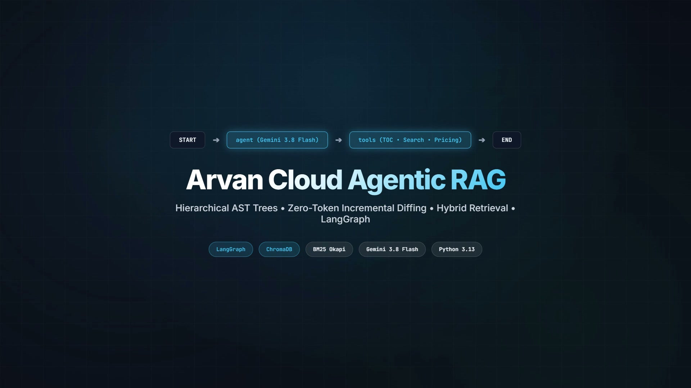
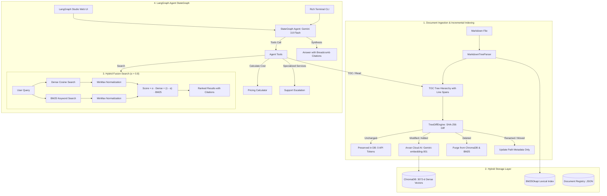

# Agentic RAG with Markdown TOC Tree, Incremental Diffing, and Hybrid Search

A production-ready **Agentic Retrieval-Augmented Generation (RAG)** application designed for technical cloud documentation, built with **LangGraph**, **LangChain**, and **Google AI Studio (Gemini 3.8 / 2.0 Flash)**.

---

## 🎬 Project Showcase & Launch Video

<p align="center">
  <video src="brag.mp4" poster="brag.jpg" width="100%" controls playsinline autoplay muted loop>
    <a href="brag.mp4">
      
    </a>
  </video>
</p>

<p align="center">
  <em>Click above to play the launch video (<b><a href="brag.mp4">brag.mp4</a></b> • 19s 1080p with audio) showcasing the zero-token diff engine, hybrid search retrieval, and LangGraph orchestration.</em>
</p>

---

## 🌟 Key Features

1. **Multi-Format Ingestion with LangChain & Custom AST (`UniversalDocumentLoader`)**:
   - **Markdown (`.md`)**: Parses documents into an Abstract Syntax Tree (AST) Table of Contents based on ATX headings (`#` to `######`), preserving code comments and line spans.
   - **PDF (`.pdf`)**: Employs LangChain's official **`PyPDFLoader`** coupled with **`RecursiveCharacterTextSplitter`** to extract and split page content with page-level breadcrumbs (`Doc > Page N`).
   - **Text (`.txt`)**: Utilizes LangChain's official **`TextLoader`** and **`RecursiveCharacterTextSplitter`** for clean, uniform chunking.
   - Unifies all formats into structured `MarkdownDocument` and `TOCNode` trees for seamless indexing.

2. **Incremental Tree Diff Engine (`TreeDiffEngine`)**:
   - Compares document versions to detect **Unchanged**, **Modified**, **Added**, **Deleted**, and **Renamed/Moved** sections.
   - **Zero-Token Invariant**: Preserves unchanged sections without calling embedding APIs, saving substantial tokens and API costs.
   - Renamed/Moved heading optimization updates metadata directly without re-embedding.

3. **Complete Document Lifecycle & Outdated Content Management**:
   - Fully supports adding, updating, and **completely deleting** documents (`DELETE /api/documents/{doc_id}` and `cli delete`).
   - Purges obsolete entries from **ChromaDB**, **BM25**, and registry metadata, guaranteeing that outdated documentation never leaks into future queries.

4. **Hybrid Search Store (`HybridSearchStore`)**:
   - Combines **Dense Semantic Embeddings** (ChromaDB + Arvan Cloud AI `Gemini-embedding-001`) with **Lexical Keyword Search** (BM25 Okapi).
   - MinMax normalization balances unbounded BM25 scores with cosine similarity.
   - Tunable alpha coefficient $\alpha \in [0.0, 1.0]$ (Default: $\alpha = 0.8$):
     $$\text{Score}(d) = \alpha \cdot \text{NormalizedDenseScore}(d) + (1 - \alpha) \cdot \text{NormalizedBM25Score}(d)$$

5. **Production REST API & Postman Collection**:
   - Built with **FastAPI** featuring auto-generated OpenAPI documentation and interactive **Swagger UI** (`/docs`).
   - Ready-to-use Postman Collection ([`arvan_rag.postman_collection.json`](arvan_rag.postman_collection.json)) for instant API testing.
   - Endpoints for querying with citations, hybrid search, document ingestion (multipart upload), TOC inspection, document deletion, and pricing calculations.

6. **Grounded Answers with Traceable Citations**:
   - Every generated answer is strictly grounded in retrieved documentation sections or pages.
   - Formats citations explicitly: `[Doc > Section/Page]`.
   - When documentation is insufficient, the agent explicitly declares the lack of information rather than hallucinating.

7. **Official Cloud Server Pricing Calculator (`calculate_server_price`)**:
   - Calculates exact hourly and monthly costs in **Tomans (تومان)** based on official Arvan Cloud Server pricing tables.
   - **Mandatory Requirements**: `cpu_cores`, `ram_gb`, `storage_gb`.
   - **Optional Parameters**: `region` (`iran`/`europe`), `tier` (`basic`/`standard`/`premium`), `storage_type` (`ssd`/`hdd`), `download_traffic_gb`, `upload_traffic_gb`, `backup_gb`, `snapshot_gb`.
   - Generates formatted Persian Markdown cost breakdowns.

8. **Customer Support Escalation Protocol (`escalate_to_support`)**:
   - Enforces a clear policy: specialized services (Local Disk, File Storage/NFS, Additional IPs, GPUs, BYOIP) are escalated directly to support and sales rather than automated guessing.

9. **LangGraph Agent with Persian Knowledge Prompt**:
   - Native Persian system prompt equipped with domain expertise across Arvan Cloud Server infrastructure.
   - Cycled tool-calling StateGraph: `START` $\to$ `agent` $\to$ `tools` $\to$ `agent` $\to$ `END`.
   - Rich interactive CLI, REST API, and official **LangGraph Studio** visual UI support.

---

## 🏗️ System Architecture



---

## 🚀 Quickstart & Setup

### 1. Requirements
- Python 3.12 or 3.13
- [`uv`](https://github.com/astral-sh/uv) package manager

### 2. Install Dependencies
```bash
uv sync
```

### 3. Environment Configuration
Copy `.env.example` to `.env`:
```bash
cp .env.example .env
```

Configure your credentials in `.env`:
```env
# Arvan Cloud AI Embedding Credentials (OpenAI-compatible)
ARVAN_AI_BASE_URL=https://models-interview.arvancloudai.ir/v1
ARVAN_AI_API_KEY=your_arvan_api_key_here
EMBEDDING_MODEL=Gemini-embedding-001

# Google GenAI Credentials
GOOGLE_API_KEY=your_gemini_api_key_here
LLM_MODEL=gemini-3.8-flash

# Storage & Retrieval Defaults
CHROMA_PERSIST_DIR=./.chroma_data
DEFAULT_ALPHA=0.8
TOP_K=4
```
*(Note: If no API keys are present, the system defaults to an offline deterministic embedding function for tests and CI/CD).*

---

## 💻 CLI Commands

### 1. Ingest Documents (Multi-Format Support)
Ingests Markdown (`.md`), PDF (`.pdf`), or plain text (`.txt`):
```bash
# Markdown ingestion (hierarchical AST TOC parsing)
uv run python -m arvan_project.cli ingest docs/sample_architecture.md

# PDF ingestion (LangChain PyPDFLoader + RecursiveCharacterTextSplitter)
uv run python -m arvan_project.cli ingest interview-task.pdf --doc-id interview_task

# Plain text ingestion (LangChain TextLoader + RecursiveCharacterTextSplitter)
uv run python -m arvan_project.cli ingest server_notes.txt
```

Re-running ingestion on an unchanged file guarantees **0 API tokens** through SHA-256 diffing:
```bash
uv run python -m arvan_project.cli ingest docs/sample_architecture.md
# Total nodes requiring embedding: 0
```

### 2. List Indexed Documents
Display all documents currently registered in the hybrid index:
```bash
uv run python -m arvan_project.cli list
```

### 3. View Document Table of Contents (TOC)
Inspect the visual hierarchy of an indexed document:
```bash
uv run python -m arvan_project.cli toc sample_architecture
```

### 4. Delete a Document (Complete Change Management)
Purges a document completely from ChromaDB, BM25, and metadata registry so it never impacts future queries:
```bash
uv run python -m arvan_project.cli delete interview_task
```

### 5. Perform Hybrid Search
Run hybrid fusion search with configurable $\alpha$:
```bash
# Default balanced-semantic hybrid search (alpha = 0.8)
uv run python -m arvan_project.cli search "S3 object storage durability" --alpha 0.8

# Pure BM25 keyword search (alpha = 0.0)
uv run python -m arvan_project.cli search "64,000 IOPS" --alpha 0.0

# Pure semantic vector search (alpha = 1.0)
uv run python -m arvan_project.cli search "virtual network isolation" --alpha 1.0
```

### 6. Interactive Agent Chat (CLI)
Chat interactively with the AI agent in your terminal:
```bash
uv run python -m arvan_project.cli chat
```

---

## 🌐 Production REST API & Swagger Documentation

A production-grade REST API built with **FastAPI** enables seamless integration with external clients, microservices, and frontends.

### Start the API Server
```bash
uv run uvicorn arvan_project.api:app --host 0.0.0.0 --port 8000 --reload
```

### Interactive Documentation & Swagger UI
- **Interactive Swagger UI**: [http://localhost:8000/docs](http://localhost:8000/docs)
- **ReDoc Alternative UI**: [http://localhost:8000/redoc](http://localhost:8000/redoc)
- **OpenAPI Schema (JSON)**: [http://localhost:8000/openapi.json](http://localhost:8000/openapi.json)

### Postman Collection
A complete Postman Collection is available in the repository root:
- **File**: [`arvan_rag.postman_collection.json`](arvan_rag.postman_collection.json)
- Import directly into Postman or Insomnia to immediately execute requests with pre-configured request bodies and environment variables.

### API Endpoints Reference

| Method | Endpoint | Description |
| :--- | :--- | :--- |
| `GET` | `/api/health` | Healthcheck and index status (vector count, BM25 document count). |
| `POST` | `/api/query` | Ask questions to the LangGraph agent; returns grounded answer with citations (`[Doc > Section/Page]`). |
| `POST` | `/api/search` | Search indexed documentation via hybrid fusion (configurable `alpha` and `top_k`). |
| `POST` | `/api/documents/ingest` | Upload and ingest a document (`.md`, `.pdf`, `.txt`) using multipart form data with incremental diffing. |
| `GET` | `/api/documents` | List all indexed document IDs with title and node counts. |
| `GET` | `/api/documents/{doc_id}/toc` | Retrieve the full hierarchical Table of Contents (TOC) tree for a document. |
| `DELETE` | `/api/documents/{doc_id}` | Permanently delete a document from ChromaDB, BM25, and registry. |
| `POST` | `/api/calculator/price` | Calculate official Arvan Cloud Server hourly/monthly pricing in Tomans. |

---

## 🧠 Embedding Model Selection & Comparative Rationale

A critical component of this RAG architecture is selecting an embedding model capable of accurately understanding technical cloud documentation in both Persian and English.

### Comparative Matrix

| Model | Dimensions | Persian / Multilingual | Technical Cloud Domain | Serving Infrastructure | Selection Status |
| :--- | :--- | :--- | :--- | :--- | :--- |
| **`Gemini-embedding-001`** | **3072** | **Native SOTA** | Exceptional for cloud terminology & architectures | **Arvan Cloud AI (Local Low Latency)** | **Selected (Primary)** |
| **`BAAI/bge-m3`** | 1024 | Excellent | High on generic benchmarks | Self-hosted / High VRAM required | Supported Alternative |
| **`text-embedding-3-large`** | 3072 / 1536 | Strong | Good | OpenAI Cloud (US Latency / Sanction Risks) | Alternative |
| **`text-embedding-3-small`** | 1536 | Moderate | Lower separation on nuanced cloud tiers | OpenAI Cloud | Not Recommended |

### Why `Gemini-embedding-001` (3072 dims)?

1. **Native Arvan Cloud AI Infrastructure**:
   - Hosted directly on Arvan Cloud AI's OpenAI-compatible inference platform (`https://models-interview.arvancloudai.ir/v1`).
   - Guarantees sub-100ms API latency without cross-border network jitter or rate limits.
2. **Dense 3072-Dimensional Vector Space**:
   - High-dimensional representations preserve subtle distinctions between similar cloud concepts (e.g., IOPS limits on SSD vs HDD, Public IP routing vs Floating IP, Local Storage vs Network Block Storage).
3. **Cross-Lingual Semantic Precision**:
   - Technical cloud documentation frequently interleaves Persian text with English keywords (e.g., *دیسک ابری SSD*, *ترافیک آپلود*, *سرویس رایانش ابری*). `Gemini-embedding-001` maps Persian terms to English technical counterparts in vector space without loss of fidelity.
4. **Deterministic Fallback Invariant**:
   - `ChromaVectorStore` includes a built-in deterministic hash embedding fallback (`SimpleHashEmbeddingFunction`), ensuring that CI/CD and offline unit testing never fail if network connectivity is interrupted.

---

## 🎨 LangGraph Studio Dev Server

Start the local development server for visual agent inspection:
```powershell
$env:PYTHONIOENCODING="utf-8"; uv run langgraph dev --no-browser --port 2024
```

Then open:
- **🎨 Interactive Studio UI**: [https://smith.langchain.com/studio/?baseUrl=http://127.0.0.1:2024](https://smith.langchain.com/studio/?baseUrl=http://127.0.0.1:2024)
- **📚 Interactive API Docs (Swagger)**: [http://127.0.0.1:2024/docs](http://127.0.0.1:2024/docs)

---

## 🧮 Pricing Calculator & Escalation Tools

### Calculator Tool (`calculate_server_price`)
Computes official hourly and monthly prices for Arvan Cloud Server resources.
- **Mandatory parameters**:
  - `cpu_cores`: Number of vCPU cores.
  - `ram_gb`: RAM size in GB.
  - `storage_gb`: Cloud disk storage size in GB.
- **Optional parameters**:
  - `region`: `'iran'` or `'europe'` (default: `'iran'`).
  - `tier`: `'basic'`, `'standard'`, or `'premium'` (default: `'standard'`).
  - `storage_type`: `'ssd'` or `'hdd'` (default: `'ssd'`).
  - `download_traffic_gb`, `upload_traffic_gb`, `backup_gb`, `snapshot_gb`.

### Escalation Tool (`escalate_to_support`)
Specialized services requiring custom contracts or manual quota allocation are escalated directly:
- **Local Disk (دیسک لوکال)**
- **File Storage (فایل استوریج / NFS)**
- **Additional IP Addresses (نشانی‌های IP عمومی یا اضافه)**
- **GPUs (پردازنده‌های گرافیکی NVIDIA AI)**
- **BYOIP (انتقال رنج آی‌پی اختصاصی)**

For detailed pricing matrices and formulas, see [docs/pricing_calculator.md](file:///c:/Users/mnp/Documents/Projects/arvan-project/docs/pricing_calculator.md).

---

## 🧪 Automated Testing

Execute the test suite:
```bash
uv run pytest -v
```

All **32 unit and integration tests** validate:
- Heading hierarchy and code comment handling ([tests/test_parser.py](file:///c:/Users/mnp/Documents/Projects/arvan-project/tests/test_parser.py))
- Multi-format document loading for Markdown, PDF, and Text using LangChain solutions ([tests/test_loaders.py](file:///c:/Users/mnp/Documents/Projects/arvan-project/tests/test_loaders.py))
- Complete document deletion lifecycle from ChromaDB, BM25, and registry ([tests/test_deletion.py](file:///c:/Users/mnp/Documents/Projects/arvan-project/tests/test_deletion.py))
- Incremental diffing: unchanged, modified, added, deleted, and moved nodes ([tests/test_diff.py](file:///c:/Users/mnp/Documents/Projects/arvan-project/tests/test_diff.py))
- BM25 indexing, Chroma storage, and hybrid search alpha weighting ([tests/test_hybrid_search.py](file:///c:/Users/mnp/Documents/Projects/arvan-project/tests/test_hybrid_search.py))
- FastAPI REST endpoints, multipart ingest, search, queries, and pricing ([tests/test_api.py](file:///c:/Users/mnp/Documents/Projects/arvan-project/tests/test_api.py))
- Pricing calculator and traffic calculations ([tests/test_calculator.py](file:///c:/Users/mnp/Documents/Projects/arvan-project/tests/test_calculator.py))
- Agent tool calling, escalation tool, and LangGraph StateGraph compilation ([tests/test_agent.py](file:///c:/Users/mnp/Documents/Projects/arvan-project/tests/test_agent.py))

Validate LangGraph configuration:
```bash
uv run langgraph validate
```

---

## 📚 Technical Documentation Directory

- [docs/architecture.md](file:///c:/Users/mnp/Documents/Projects/arvan-project/docs/architecture.md): Detailed architectural design, normalization formulas, and data flow.
- [docs/pricing_calculator.md](file:///c:/Users/mnp/Documents/Projects/arvan-project/docs/pricing_calculator.md): Official pricing rates, calculator API, and support escalation protocols.
- [docs/sample_architecture.md](file:///c:/Users/mnp/Documents/Projects/arvan-project/docs/sample_architecture.md): Sample cloud platform documentation used for tests.
