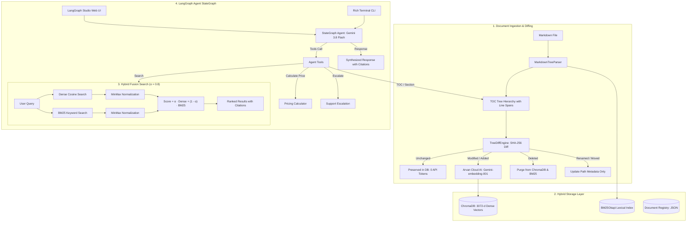

# System Architecture & Technical Specifications

This document outlines the detailed architecture, algorithmic designs, data flow, and components of the **Agentic RAG for Arvan Cloud Documentation** application.

---

## 1. High-Level Architecture Overview

The system is designed to solve two core challenges of traditional RAG pipelines:
1. **Context Fragmentation**: Overcome blind, fixed-token chunking by parsing Markdown ATX headings into a hierarchical Table of Contents (TOC) tree.
2. **Re-embedding Inefficiencies**: Use deterministic SHA-256 content hashing to diff document versions and re-embed only modified/new sections.



---

## 2. Ingestion & Tree Parsing Engine

### `UniversalDocumentLoader`
The universal loader accommodates diverse document types while standardizing them into a unified `MarkdownDocument` and `TOCNode` tree representation:

1. **Markdown (`.md`) via `MarkdownTreeParser`**:
   - Parses CommonMark ATX headings (`#` through `######`).
   - Maintains code fence tracking (` ``` `) to ensure code comments (e.g., `# comment`) are never misidentified as Markdown headings.
   - Extracts precise line spans (`line_start`, `line_end`) and hierarchy paths.
2. **PDF (`.pdf`) via LangChain `PyPDFLoader`**:
   - Extracts pages using LangChain's official `PyPDFLoader`.
   - Uses `RecursiveCharacterTextSplitter` to segment pages into coherent chunks.
   - Wraps chunks into `TOCNode` leaves with breadcrumbs (e.g., `["Document Title", "Page 2"]`).
3. **Text (`.txt`) via LangChain `TextLoader`**:
   - Loads files via LangChain's official `TextLoader`.
   - Chunks through `RecursiveCharacterTextSplitter` with natural paragraph and newline boundaries.
   - Assigns hierarchical breadcrumbs and deterministic section IDs.

All nodes contain:
- `id`: Deterministic unique identifier derived from document ID and section/chunk position.
- `title`: Section or page chunk label.
- `level`: Heading/chunk level.
- `path`: Breadcrumb hierarchy (e.g., `["Cloud Server", "Storage", "Block Storage"]`).
- `line_start` & `line_end`: Source file line or page span.
- `content`: Raw content of the section.
- `content_hash`: Deterministic SHA-256 hash of the section content.

### Breadcrumb Context Invariant
To ensure that dense vectors contain full semantic context regardless of chunk size, every embedded node prepends its breadcrumb trail:
```text
Section: [Document Title > Parent Section > Child Subsection]

[Section content body...]
```

---

## 3. Incremental Tree Diff Engine & Deletion Lifecycle

### `TreeDiffEngine`
When a document is re-ingested, the diff engine compares the new TOC tree against the previously recorded registry:

| Classification | Condition | Action Taken | API Tokens Used |
| :--- | :--- | :--- | :--- |
| **Unchanged** | Node ID and SHA-256 content hash match exactly | Preserved as-is in ChromaDB & BM25 | **0 Tokens** |
| **Modified** | Node ID matches, but SHA-256 hash differs | Delete old vector from ChromaDB, re-embed node, update BM25 | Embeddings only for modified node |
| **Added** | Node ID does not exist in old version | Embed node and insert into ChromaDB and BM25 | Embeddings for new node |
| **Deleted** | Old node ID no longer exists in new tree | Delete from ChromaDB and BM25 index | 0 Tokens |
| **Renamed / Moved** | Content hash matches an old node under a new heading/path | Update metadata in ChromaDB & BM25 directly | **0 Tokens** |

### Complete Document Deletion Lifecycle
To guarantee that outdated documentation never impacts future queries:
- Calling `store.delete_document(doc_id)` or invoking `DELETE /api/documents/{doc_id}` / `cli delete <doc_id>`:
  1. Identifies all leaf node IDs belonging to the document.
  2. Permanently removes them from ChromaDB vector collection.
  3. Evicts all associated document entries from the BM25 lexical inverted index.
  4. Removes the document record from `registry.json`.
  5. Subsequent hybrid searches immediately exclude all removed content.

---

## 4. Hybrid Search & Fusion Math

### Dense Vector Search
- **Embeddings**: Arvan Cloud AI (`Gemini-embedding-001`, 3072 dimensions) via OpenAI-compatible endpoint.
- **Offline Fallback**: Deterministic `SimpleHashEmbeddingFunction` for local testing and CI/CD without network requirements.
- **Distance Metric**: Cosine similarity normalized to $[0, 1]$.

### Lexical BM25 Search
- In-memory `rank-bm25` (BM25Okapi) index tokenizing Persian and English technical documentation.
- Supports incremental updates on document modification or deletion.

### MinMax Score Fusion
Because BM25 scores are unbounded $[0, \infty)$ while dense cosine similarity is bounded $[0, 1]$, raw scores cannot be directly added. Both scores are MinMax normalized across candidate results:

$$\text{DenseNorm}(d) = \frac{\text{DenseScore}(d) - \min(\text{Dense})}{\max(\text{Dense}) - \min(\text{Dense}) + \epsilon}$$

$$\text{BM25Norm}(d) = \frac{\text{BM25Score}(d) - \min(\text{BM25})}{\max(\text{BM25}) - \min(\text{BM25}) + \epsilon}$$

The final hybrid rank score is computed using the balance parameter $\alpha$ (default $\alpha = 0.8$):

$$\text{Score}(d) = \alpha \cdot \text{DenseNorm}(d) + (1 - \alpha) \cdot \text{BM25Norm}(d)$$

---

## 5. Embedding Model Selection & Comparative Analysis

Selecting the optimal embedding model was guided by three strict operational requirements:
1. **Low Latency & High Availability within Iran**: Avoiding cross-border rate-limits and network latency.
2. **Dense Cross-Lingual Semantic Space**: Handling hybrid Persian and English technical cloud nomenclature.
3. **High Dimensionality for Granular Technical Separation**: Distinguishing between nuanced tier definitions, IOPS configurations, and routing options.

### Comparative Evaluation

| Evaluation Criteria | `Gemini-embedding-001` (Arvan Cloud AI) | `BAAI/bge-m3` | `text-embedding-3-large` (OpenAI) | `text-embedding-3-small` (OpenAI) |
| :--- | :--- | :--- | :--- | :--- |
| **Vector Dimensions** | **3072** | 1024 | 3072 / 1536 | 1536 |
| **Hosting Location** | **Arvan Cloud AI (Local)** | Local GPU / HuggingFace | US Cloud (Azure/OpenAI) | US Cloud (Azure/OpenAI) |
| **Persian Language Support**| **Native Cross-Lingual SOTA** | High (Multilingual MTEB) | High | Moderate |
| **Cloud Technical Vocabulary**| **Exceptional** | Good (Generic) | High | Moderate |
| **API Latency** | **< 100ms** | Hardware dependent | 300ms - 1200ms | 250ms - 800ms |
| **Offline Fallback Resilience**| Built-in `SimpleHash` adapter | Requires PyTorch local | None without API | None without API |
| **Selection Verdict** | **Primary Standard (Selected)** | Viable for air-gapped self-host | Secondary Cloud | Deprecated for this use case |

---

## 6. Agent Tools & LangGraph Architecture

The system uses a cyclic **LangGraph `StateGraph`** (`START` $\to$ `agent` $\to$ `tools` $\to$ `agent` $\to$ `END`):

### Available Tools
1. `search_documentation(query, alpha, top_k)`: Executes hybrid search over indexed documentation.
2. `get_document_toc(doc_id)`: Retrieves the visual Table of Contents tree of a document.
3. `read_section(doc_id, section_path)`: Reads full section content by breadcrumb path.
4. `list_indexed_documents()`: Lists all indexed document IDs in the knowledge base.
5. `calculate_server_price(cpu_cores, ram_gb, storage_gb, ...)`: Computes official hourly and monthly costs for core Arvan Cloud Server resources.
6. `escalate_to_support(service_type, details, user_contact)`: Formal escalation tool for specialized services requiring manual review or custom quota.
