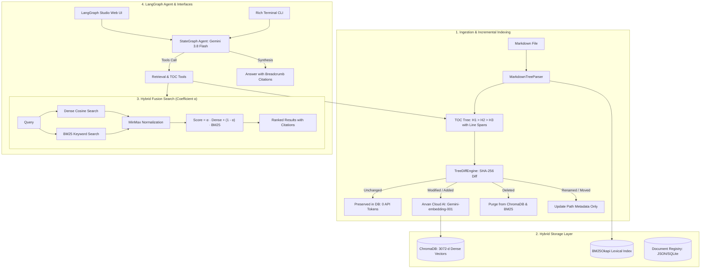

# Agentic RAG with Markdown TOC Tree, Incremental Diffing, and Hybrid Search

## 1. Project Overview & Purpose

### What Does This Project Do?
This project is an enterprise-grade **Agentic Retrieval-Augmented Generation (RAG)** application built with **LangGraph**, **LangChain**, and **Arvan Cloud AI / Google AI Studio**. It takes raw Markdown technical documentation, parses it into an Abstract Syntax Tree (AST) / Table of Contents (TOC) hierarchy, embeds each section alongside its hierarchical breadcrumb path, and provides autonomous tool-calling retrieval for conversational agents.

### Why Was It Built? (The Problem It Solves)
Traditional RAG pipelines suffer from two major architectural flaws:
1. **Context Fragmentation (Blind Fixed-Size Chunking)**:
   Standard chunkers divide text by arbitrary token counts (e.g., 500 tokens). This breaks code blocks, separates tables from their headers, and strips isolated paragraphs of their parent context. A sentence like *"Set this to false in production"* is meaningless without knowing whether it belongs to `Security > Authentication` or `Database > Debugging`.
   - **Our Solution**: The **`MarkdownTreeParser`** respects semantic boundaries, organizing documents by ATX headings (`#` to `######`). Every chunk embeds its full hierarchical breadcrumb path (`Section: Cloud Guide > Networking > VPC`), ensuring maximum semantic precision.
2. **Exorbitant Re-embedding Costs on Updates**:
   In traditional RAG, when a 50-page document changes by even a single sentence, the entire document is re-embedded, burning thousands of LLM API tokens, risking rate limits, and slowing ingestion.
   - **Our Solution**: The **`TreeDiffEngine`** uses deterministic SHA-256 content hashing to compare document versions. When a document is updated, **only the modified or newly added nodes are re-embedded**, while unchanged nodes are preserved at **zero API cost**.

---

## 2. System Architecture



---

## 3. Quickstart & Installation

### Prerequisites
- Python 3.12 or 3.13
- `uv` package manager (`curl -LsSf https://astral.sh/uv/install.sh` or `scoop install uv`)

### Step 1: Install Dependencies
```bash
uv sync
```

### Step 2: Configure Environment Variables
Copy `.env.example` to `.env`:
```bash
cp .env.example .env
```
Ensure your `.env` contains your credentials:
```env
# Arvan Cloud AI Embedding Credentials (OpenAI-compatible)
ARVAN_AI_BASE_URL=https://models-interview.arvancloudai.ir/v1
ARVAN_AI_API_KEY=your_arvan_api_key_here
EMBEDDING_MODEL=Gemini-embedding-001

# Google AI Studio Gemini Credentials
GOOGLE_API_KEY=your_gemini_api_key_here
LLM_MODEL=gemini-3.8-flash

# ChromaDB Storage
CHROMA_PERSIST_DIR=./.chroma_data
DEFAULT_ALPHA=0.5
TOP_K=4
```

---

## 4. How to Add and Update Documents

### Adding a New Markdown Document
1. Place your Markdown file anywhere on disk (e.g. `docs/my_service.md`).
2. Run the ingestion command:
   ```bash
   uv run python -m arvan_project.cli ingest docs/my_service.md
   ```
   *Output*:
   - Renders the complete hierarchical Table of Contents (TOC) tree with `(branch)` and `(leaf)` indicators.
   - Computes 3072-dimensional embeddings via Arvan Cloud AI in parallel.
   - Stores dense vectors in ChromaDB and registers tokens in the BM25 index.

### Updating an Existing Document (Incremental Diffing)
1. Edit any section in `docs/my_service.md` (e.g. modify one paragraph or add a new heading).
2. Re-run ingestion:
   ```bash
   uv run python -m arvan_project.cli ingest docs/my_service.md
   ```
   *What Happens*:
   - The `TreeDiffEngine` compares SHA-256 hashes against the previous version.
   - Shows an **Incremental Tree Diff Summary**:
     - `Unchanged (Preserved)`: Kept as-is without calling embedding APIs.
     - `Modified (Re-embedded)`: Only the changed section is re-embedded.
     - `Added (Embedded)`: New sections are added.
     - `Deleted (Removed)`: Deleted sections are purged.
     - `Renamed/Moved`: Path metadata is updated with **zero** re-embedding tokens!

---

## 5. Accessing Features & Interfaces

### Feature 1: Visual Table of Contents (TOC) Inspector
Inspect the structural hierarchy of any ingested document:
```bash
uv run python -m arvan_project.cli toc my_service
```

### Feature 2: Hybrid Search with Tunable Alpha ($\alpha$)
Search the indexed knowledge base using dense semantic vectors, BM25 lexical keywords, or a weighted blend:
$$\text{Score}(d) = \alpha \cdot \text{Dense}(d) + (1 - \alpha) \cdot \text{BM25}(d)$$

```bash
# Balanced Hybrid Search (Default: alpha = 0.5)
uv run python -m arvan_project.cli search "S3 object storage durability" --alpha 0.5

# High Semantic Search (alpha = 0.8) - Great for conceptual questions
uv run python -m arvan_project.cli search "scalable compute capacity" --alpha 0.8

# Pure BM25 Keyword Search (alpha = 0.0) - Great for exact technical terms or codes
uv run python -m arvan_project.cli search "64,000 IOPS" --alpha 0.0
```

### Feature 3: Interactive Terminal Chat (CLI)
Interact directly with the Gemini 3.8 Flash agent equipped with tool-calling capabilities:
```bash
uv run python -m arvan_project.cli chat
```
The agent automatically calls:
- `search_documentation(query, alpha, top_k)` to retrieve context.
- `get_document_toc(doc_id)` to understand whole-document structure.
- `read_section(doc_id, section_path)` to inspect full section contents.

### Feature 4: Interactive Web UI via LangGraph Studio
Launch the local LangGraph development server:
```bash
uv run langgraph dev --port 2024
```
Then open your browser to:
- **🎨 LangGraph Studio Web UI**: [https://smith.langchain.com/studio/?baseUrl=http://127.0.0.1:2024](https://smith.langchain.com/studio/?baseUrl=http://127.0.0.1:2024)
- **📚 Interactive Swagger API Docs**: [http://127.0.0.1:2024/docs](http://127.0.0.1:2024/docs)

**What you can do in LangGraph Studio**:
1. View the live visual graph state machine (`START` $\to$ `agent` $\to$ `tools` $\to$ `agent` $\to$ `END`).
2. Type chat queries and watch tools trigger in real time.
3. Inspect the state payload, input messages, and retrieved document citations at every step.
4. Rewind, edit state, and replay turns directly from the web interface.

---

## 6. Automated Verification

Run the test suite covering parsing, tree diffing, BM25 indexing, Chroma storage, and LangGraph agent tools:
```bash
uv run pytest -v
```
All 15 automated unit and integration tests pass cleanly in under 3 seconds.
